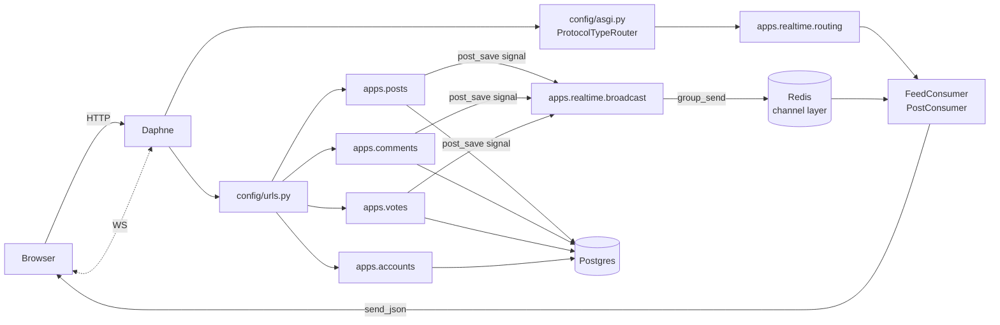

# Architecture

One-pager for the M2 session. Read alongside the plan at
`/Users/albertding/.claude/plans/we-are-making-a-nested-dawn.md`.

## The shape

## Two invariants

1. **Only `apps.realtime.broadcast` touches the channel layer.** Domain apps
   call typed broadcast functions; they never import `channels.layers`.
2. **Daphne handles HTTP + WS in one process** via `ProtocolTypeRouter` in
   `config/asgi.py` — no separate gunicorn, no separate WS worker.

## Tech stack

- **Backend:** Django 5.0 LTS + PostgreSQL 16
- **Frontend:** Django templates + HTMX 1.9 + Alpine 3.14
- **Real-time:** Django Channels 4 + channels-redis 4 + Daphne 4
- **Auth:** nickname-only, session-backed
- **Hosting:** Render free tier (web + managed Postgres + managed Redis)
- **CI:** GitHub Actions
- **CD:** Render auto-deploy on merge to `main`

## Module ownership

| App | Owns | Imports |
|---|---|---|
| `core` | Abstract models, middleware, `/healthz`, `/version`, `base.html` | nothing |
| `accounts` | `User`, picker view, `NicknameSessionBackend` | nothing |
| `posts` | `Post`, feed, post CRUD | `tags`, `realtime.broadcast` |
| `comments` | `Comment`, threading, comment CRUD | `posts.Post`, `realtime.broadcast` |
| `votes` | `Vote` (GFK), `cast_vote` | `realtime.broadcast` |
| `tags` | `Tag`, tag pages *(M3)* | nothing |
| `search` | PG FTS service *(M3)* | `posts.Post` |
| `realtime` | Consumers, routing, broadcast API | nothing |
